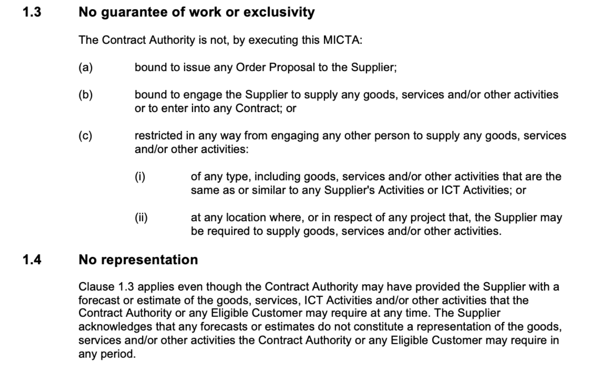

# Contract-Editor

TODO: start work on building backend (i.e. parser functions)!!!
1. txt (i.e. the DSL language i create) --> JSON
2. JSON --> PDF / DOCX


## Overview

An app for lawyers to draft contracts programmatically; an IDE for lawyers to draft contracts programatically (incl. the programmatic language).

>"there is a crucial similarity between lawyers and programmers: the way they use words. Computer science and law are both linguistic professions. Programmers and lawyers use language to create, manipulate, and interpret complex abstractions. A programmer who uses the right words in the right way makes a computer do something. A lawyer who uses the right words in the right way changes people’s rights and obligations. There is a nearly exact analogy between the text of a program and the text of a law.": [[grimmelmannProgrammingLanguagesLaw2022]]

## How I see it working

A code editor for lawyers. This editor will have the lawyer draft contracts in the same manner a software developer would code. It is simply a tool to draft contracts. The code will contain the drafting of a contract along with all the code necessary to format the contract. The human-readable contract will appear adjacent to your code and will live-update with every amendment to your drafting. 

The far right hand side will show the lawyer the data stored in the contract. For example, it will show all defined terms instantiated. This would be similar to the 'environment' pane in RStudio.

The language to generate the contract may be approached in a couple different ways:
* The code may be a Domain Specific Language which specifies how you want your contract to be generated. This would then be parsed/compiled to generate the contract. This would involve creating a brand new language and create a new compiler/interpreter.
* It may be something like the mdx project. In that project, markdown (ordinary text) is mixed with react components (javascript code), allowing your text to have interactive components interlaced. 
	* This could be implemented similarly to how the Accord Project builds their templating project. The text for Accord Project templates is written using markdown. It builds on the CommonMark standard so that any CommonMark document is valid text for a template or contract. Accord Project uses two extensions to CommonMark: CiceroMark for the contract text, and TemplateMark for the template grammar.
	* Also, I could add parameters to these 'clause' blocks (e.g. a random ID, a clause reference) so that you can make cross references
		* to allow for dynamic cross references, you would add event listeners to each clause block, and where the new state (i.e. the clause number) is different to the past state (i.e. the clause number before you made the amendment), you would update the cross reference
	* However, if i am to use a markdown --> HTML method, I will need to know how the HTML would look like for a solid contract. This involves checking if 

It would be a 'hybrid' contract. It would not be 'smart' and self-executable, however it could be adapted to do so.

The code will be written in separate files, similar to a web application framework. There will be a config file (where you can set the formatting options), a main file, a data file (if necessary), etc. 

## Mock-up

[Project Mock-up](<Contract Editor project wireframe.pdf>)

## Working backwards

### Example clause
I will use the following clause from the Master ICT Agreement of the MICTA/ICTA contracting framework:



### Psudo-code

```
let "Contract Authority" = "means the contractual relationship between the parties comprising the terms and conditions set out in:
(a)     a relevant"+<<Order>>+"; and
(b)     the"+<<ICTA>>+"."
let "MICTA" = ...
let "Order Proposal" = "means a proposal in the form set out in "+<<Annexure D>>+"or in a form chosen by the "+<<Eligible Customer>>+" or the State of New South Wales."
let "Supplier" = ...
let "Contract" = ...
let "Supplier's Activities" = ...
let "ICT Activities" = ...
let "Contract Authority" = ...
let "Eligible Customer" = ...
let "Order" = ...
let "ICTA" = ...
let "Eligible Customer" = ...

***

{{##clause noGuaranteeOfWorkOrExclusivity}}
## No guarantee of work or exclusivity 

The <<Contract Authority>> is not, by executing this <<MICTA>>:

{{###clause}}bound to issue any <<Order Proposal>> to the <<Supplier>>;{{/clause}}
{{###clause}}bound to engage the <<Supplier>> to supply any goods, services and/or other activities or to enter into any <<Contract>>; or{{/clause}}
{{###clause}}restricted in any way from engaging any other person to supply any goods, services and/or other activities:{{/clause}}
{{####clause}}of any type, including goods, services and/or other activities that are the same as or similar to any <<Supplier's Activities>> or <<ICT Activities>>; or{{/clause}}
{{####clause}}at any location where, or in respect of any project that, the <<Supplier>> may be required to supply goods, services and/or other activities.{{/clause}}

{{/clause}}

{{##clause noRepresentation}}
### No representation

Clause {{ref noGuaranteeOfWorkOrExclusivity}}{{/ref}} applies even though the <<Contract Authority>> may have provided the <<Supplier>> with a forecast or estimate of the goods, services, <<ICT Activities>> and/or other activities that the <<Contract Authority>> or any <<Eligible Customer>> may require at any time. The <<Supplier>> acknowledges that any forecasts or estimates do not constitute a representation of the goods, services and/or other activities the <<Contract Authority>> or any <<Eligible Customer>> may require in any period.

{{/clause}}

```

***
## Project structure (suggested by GPT)

### Structure
Here's a proposed file structure using Next.js:

/legal-contract-editor/
|-- pages/
|   |-- _app.js
|   |-- index.js
|   |-- editor.js
|-- components/ 
|   |-- Editor/
|   |   |-- TextEditor.js
|   |   |-- LivePreview.js
|   |   |-- ContractData.js
|   |-- Common/
|   |   |-- Header.js
|   |   |-- Footer.js
|-- public/
|   |-- styles/
|   |   |-- globals.css
|-- lib/
|   |-- parser.js
|   |-- generator.js
|-- hooks/
|   |-- useContract.js
|-- contexts/
|   |-- ContractContext.js
|-- config/
|   |-- index.js
|-- assets/
|-- utils/
|-- README.md
|-- package.json
|-- next.config.js


### Key Components

1. **Pages:**
    - `index.js`: Landing page.
    - `editor.js`: Main editor interface where contracts are drafted.
2. **Components:**
    - `TextEditor.js`: Where the contract text is written; integrates with Markdown and specialized tagging for legal clauses.
    - `LivePreview.js`: Displays a live, human-readable version of the contract as it's being edited.
    - `ContractData.js`: Sidebar component showing defined terms, clause references, and other meta information akin to RStudio's environment pane.
3. **Lib:**
    - `parser.js`: Parses the bespoke language/markdown into usable data.
    - `generator.js`: Compiles the contract into both human-readable and legally precise documents.
4. **Hooks:**
    - `useContract.js`: Manages state for the contract, handling updates, and caching.
5. **Contexts:**
    - `ContractContext.js`: Provides contract data across all components where needed.
6. **Config:**
    - `index.js`: Houses configurations like themes, user settings, etc.


